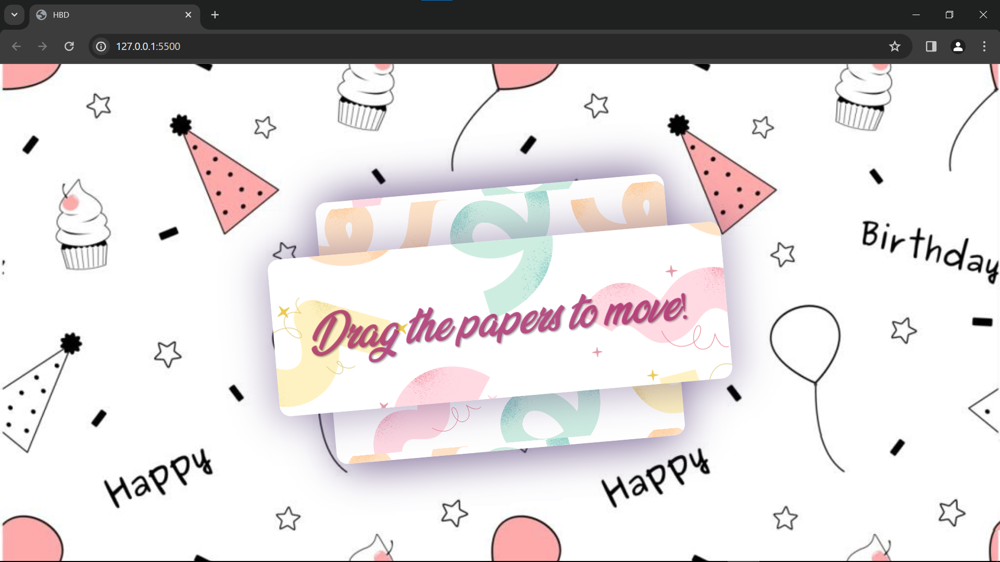
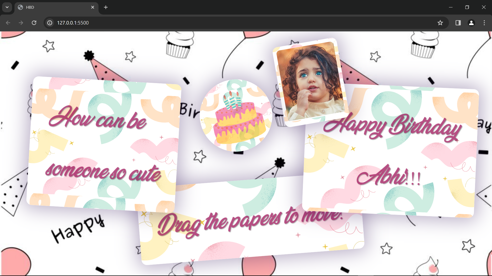

# Project Title: Interactive Greeting Card

## Description
This project offers an interactive web-based greeting card that enables users to drag and rotate different elements, such as messages and images, on the screen. Designed to provide a fun and personalized way to convey greetings for various occasions, it merges the charm of traditional greeting sentiments with the interactive capabilities of web technologies.

## Versatility
Originally conceptualized as a birthday greeting tool, this project has evolved to cater to various occasions. Whether it's for birthdays, anniversaries, proposals, or just to share a heartfelt message, the interactive greeting card offers a versatile platform for expressing sentiments in a unique and memorable way.


### Features
- **Draggable Elements**: Users can click (or touch on mobile devices) and drag to move paper elements across the screen.
- **Responsive Design**: The layout and interactions are fully responsive, ensuring a seamless experience on both desktop and mobile devices.
- **Custom Font and Images**: Incorporates a custom font and themed images to enhance the visual appeal.

## Screenshots




## Inspiration
Inspired by an Instagram reel showcasing an interactive web project with draggable and rotatable elements, this project takes that initial concept further. Although the original creator's details are unknown, their innovative idea laid the groundwork for this enhanced version. Key improvements include Touch Screen Support, optimizing the experience for modern devices and expanding its use for various occasions.


## Improvements
- **Touch Screen Support**: Added comprehensive support for touch screen devices, allowing for intuitive drag and rotate gestures.
- **Enhanced Responsiveness**: Improved the project's responsiveness to ensure compatibility and an optimized experience across a variety of screen sizes and devices.
- **UI/UX Enhancements**: Through the use of a custom font, updated images, and refined interactions, the user interface and experience have been significantly enhanced.
- **Code Optimization**: Refactored the original script for better performance and maintainability.


## Getting Started
To explore the interactive greeting card, simply clone this repository and open `index.html` in your web browser.

```bash
gh repo clone AbhiShaw67890/Interactive-Greeting-Card
cd Interactive-Greeting-Card
open index.html
```


## Customization
This project is designed with customization in mind, allowing you to tailor the website for various occasions. By modifying the HTML and CSS files, you can personalize the site to better suit your needs. Here are some suggestions for customization:

- **Wallpaper**: Change the `background-image` in the CSS file to alter the site's wallpaper, giving it a fresh look for the occasion.
- **Font**: Adjust the `font-family` and other font properties in the CSS to match the mood or theme you're aiming for.
- **Number of Papers**: Edit the HTML file to add or remove paper elements based on the amount of content you wish to include.
- **Paper Content**: Customize the text and images within each paper element in the HTML to convey your specific messages or greetings.
- **Styling**: Alter the colors, shadows, and borders in the CSS for each paper element to highlight them according to your theme.

These customizations allow for a wide range of expressions, making the project adaptable for anything from intimate personal messages to broader celebratory announcements.


## Acknowledgments
I would like to express my gratitude to the creator(s) of the original project that inspired this enhanced version. Their innovative approach to web interactions provided a great starting point for further exploration and development.